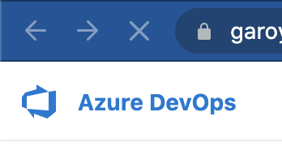
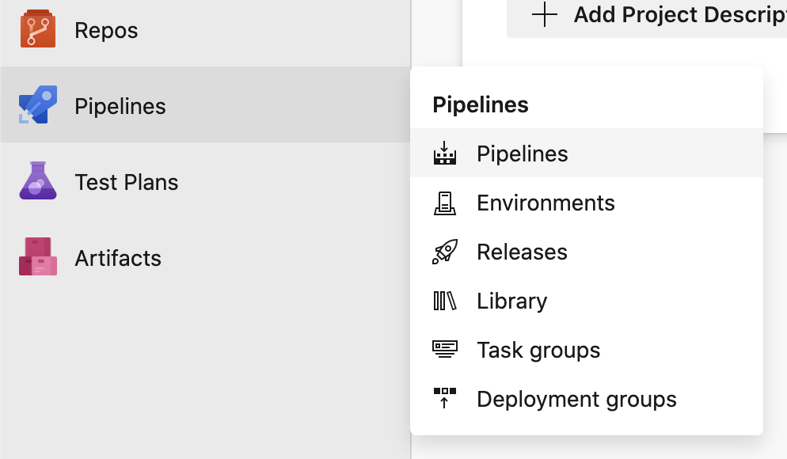
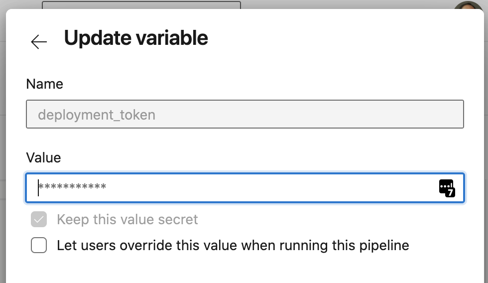

# Embracing the Static Cling

A trashy romance novel on Azure Static Web Apps and the developers who can't keep their hands off them.

## Getting Started

Once upon a time, on a quiet laptop (the fans had not kicked on yet), the developer decided to finally call upon the newest product who hailed from the land of Microsoft: Azure Static Web Apps.

The developer need help, so they called upon their most trusted friends:

* [Node JS](https://nodejs.org/)
* [.NET Core SDK 3.1](https://dotnet.microsoft.com/download/dotnet/3.1)
* [Visual Studio Code](https://code.visualstudio.com/) (any other IDE would work too)

Because Node JS tended to neglect its package manager, the developer knew to ensure that the latest version was installed (7.xx at the time of this writing):

```powershell
npm install -g npm@latest
```

The Developer, upon reading about Azure Static Web Apps and their eccentric tastes, knew that they would need some special tools if they had any chance of catching the CLIs of this new saucy cloud service. The Developer summoned a few more tools that would be needed:

* [Azure CLI](https://docs.microsoft.com/en-us/cli/azure/)
* [Azure Functions Core Tools](https://github.com/Azure/azure-functions-core-tools) (on Windows, recommend the MSI option or Chocolatey, otherwise Homebrew)
* [Static Web Apps CLI](https://github.com/azure/static-web-apps-cli) (installing using NPM)

## Public Displays of Websites

It's important to discuss first why Azure Static Web Apps is receiving such attention from the Developer. With the rich ecosystem of client side JavaScript frameworks and the proliferation of static HTML generator tools, an old flavor of web development has come back into favor with a new name: Jamstack (JavaScript and Markup ... Stack).

Jamstack applications take advantage of the fact that HTML and JavaScript in the browser can create rich complex interactions all without needing to talk to a server. Most websites that are purely information can be hosted on a simple Content Delivery Network (CDN) very inexpensively (or very freely).

Some hosts of this content: like Azure Static Web Apps and Netlify, to name two, offer free basic static content hosting, and support for executing simple server side code.

There are literally (probably) a million (likely) fish in the static template generator sea. Each day, someone decides that none of these do exactly what is desired and create a new one. This demo will cover one random one: [Docusaurus](https://docusaurus.io/) that was created by Facebook and supports React and Markdown.

First, let create a basic site using the "classic" template (there are only a few themes in this provider, so read the documentation to see what else you can do):

```powershell
mkdir static-cling
cd static-cling
git init
# if you want, rename your branch to main or something else
git branch -m main
npx @docusaurus/init@latest init --use-npm web classic
git add --all
git commit -m "Initial docusaurus"
cd web
npm start
```

At this point, your browser will likely pop up <http://localhost:3000> and show you a simple default page with some images and stuff. Press CTRL+C in your terminal to stop the web server, that's not terribly impressive yet.

## First Foray Flirtatiously Flying Files (to the Cloud)

Our intrepid Developer knows no fear (ok, maybe a little fear, which is healthy), and has traveled far to the portal of Azure. Being a Developer of some skill and boastfulness, they decide to stick with the command line for the purpose of this demo to improve the reusability of it. Let's see how the Developer fares setting the stage.

```powershell
az login
```

Follow the prompts to get logged in with your account. It will show you a list of subscriptions and you should identify the one that you are cool with deploying things into, for example:

```json
  {
    "cloudName": "AzureCloud",
    "homeTenantId": "00000000-0000-0000-0000-REDACTED0000",
    "id": "00000000-0000-0000-0000-REDACTED00ID",
    "isDefault": false,
    "managedByTenants": [],
    "name": "Garo Visual Studio Professional",
    "state": "Enabled",
    "tenantId": "00000000-0000-0000-0000-REDACTED0000",
    "user": {
      "name": "garo.yeriazarian@headspring.com",
      "type": "user"
    }
  }
```

If you have more than one subscription, you should select the appropriate one:

```powershell
az account set --subscription 00000000-0000-0000-0000-REDACTED00ID
```

To make it easy to burn everything to the ground later, we should make a Resource Group to hold our resources.

> SPECIAL NOTE: we are creating our resources in Central US because Azure Static Web Apps is only available in certain regions. You can see where it is available here: <https://azure.microsoft.com/en-us/global-infrastructure/services/?products=app-service>

```powershell
az group create --location centralus --name StaticCling
```

Next, we'll deploy the Static Web App into the Resource Group:

```powershell
az staticwebapp create --location centralus --resource-group StaticCling --name StaticCling -s "" -b "" --token "x"
```

At this point, the Static Web App is created and waiting for a deployment. The Azure CLI doesn't have all the features we need to completely manage this through the CLI, so we need to jump into the browser and see how it is going.

Navigate to your Azure Portal <https://portal.azure.com>, ensure you've got the right Subscription selected, browse your Resource Groups (cheat code here: <https://portal.azure.com/#blade/HubsExtension/BrowseResourceGroups>) 

Find your "StaticCling" Resource Group and click it, you should see a single resource there called "StaticCling", click it as well.

At the top menu, there's a link that says "Manage deployment token", hold this position so we can copy the value later.

## Continuous Integration and Delivery

When last we left our Developer, they had create some resources in Azure, but nothing interesting had really happened and nothing was deployed yet (what IS the hold-up here?). Azure Static Web Apps, being a new hotness and freshly out of beta/preview, is very picky about how it gets deployed. You can't just upload the files and call it a day, that would be too easy (well, if you are targeting GitHub, you can do just that! But that's "easy" mode so we're not doing that).

This part of the demo follows the documentation here: [Tutorial: Publish Azure Static Web Apps with Azure DevOps](https://docs.microsoft.com/en-us/azure/static-web-apps/publish-devops)

We want to deploy the site using Azure DevOps because the corporation who pays for the Developer's lavish tastes requires a bit of privacy and wants to deploy things on the down-low. This can easily be accommodated. To the local workspace, we add an Azure Pipelines file (in the root folder of the workspace):

`azure-pipelines.yml`

```yaml
trigger:
  - main

pool:
  vmImage: ubuntu-latest

steps:
  - checkout: self
    submodules: true
  - task: AzureStaticWebApp@0
    inputs:
      app_location: '/web'
      api_location: '/api'
      output_location: 'build'
    env:
      azure_static_web_apps_api_token: $(deployment_token)
```

This will allow the application to be deployed on every merge to the `main` branch. You can play on other branches and do pull requests all your want, but it won't deploy until you hit `main`.

Like our Developer, you likely have no commitment issues. So please commit all the changes and push your changes up to your favorite Git repository in the cloud.

> This code is hosted on GitHub, so you can even try to point your Azure Pipeline at this repository (it is public, just follow the Microsoft guide here: <https://docs.microsoft.com/en-us/azure/static-web-apps/get-started-portal>).

Navigate to a project, or create a new project in Azure DevOps. You should have (or can create) a personal space in your company Azure DevOps instance. If you don't have one, you can create one by clicking on the Azure DevOps logo at the top left corner: 



Then click "New organization" and follow the prompts to create your own space.

Getting back to the plot: access the Pipelines for your project here:



Click "New pipeline" at the top right.

Follow the prompts to connect Azure Pipelines to your GitHub account (or choose the Azure Repo you used instead if that's what you did).

It will automatically locate the `azure-pipelines.yml` file and show it to you.

We need to keep a secret, so click "Variables" at the top right, then go back to your Azure Portal tab where you had created the Static Web App and click "Manage deployment token", then copy that value.

Create a new variable and call it `deployment_token`, paste the value in the "Value" field and check the box that says "Keep this value secret" (a gentle-developer never tells).



Click "OK". Then save and run the pipeline.

Back on your Azure Portal tab, close the deployment token sidebar and look at another piece of info: the URL. In my case, it's: <https://purple-sand-08becb610.azurestaticapps.net/>. Once your deployment runs, this link will be hosting your static content! Try clicking around, it's a real website!

Our intrepid Developer is pleased as punch (or White Claw if that's your thing). However, this is only a fraction of the power of Azure Static Web Apps. Next, we'll bring the `func` and make some simple server-side code that we can call.

## Bringing the Func

The Developer is a sensitive, well-adjusted individual who cares about what's inside as much as what's on the outside.

> It's not fair to say that what's on the outside counts for nothing. The Developer is, after all, only human, and the market of statically hosted web applications is fairly broad. Furthermore, the Developer is known to have "swiped right" on a few hosting solutions and been filled with immense regret afterwards. At least the frontend hosting has to work properly, a Developer must have some standards.

With the initial pleasantries complete, it's time to get to know Azure Static Web Apps more intimately... through dance. Let's see how this goes.

Let's create a Function template using the command line tools. Starting from the root of your local workspace:

```powershell
mkdir api
cd api
dotnet new sln
func init StaticClingApi --worker-runtime dotnet
dotnet sln add StaticClingApi
cd StaticClingApi
func new --name SayHello --template "HTTP trigger" --authlevel "anonymous"
dotnet build
```

